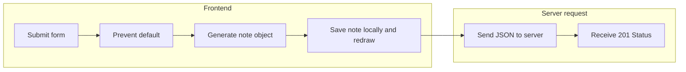

# SPA New Note Events

After the initial fetch of the page, the front only process one HTTP request to the server to the save the JSON Object.

```mermaid
flowchart LR
    subgraph Frontend
    A[Submit form] --> B[Prevent default]
    B --> C[Generate note object]
    C --> D[Save note locally and redraw]
    end
    subgraph Server request
    D --> E[Send JSON to server] 
    E --> F[Receive 201 Status]
    end
```